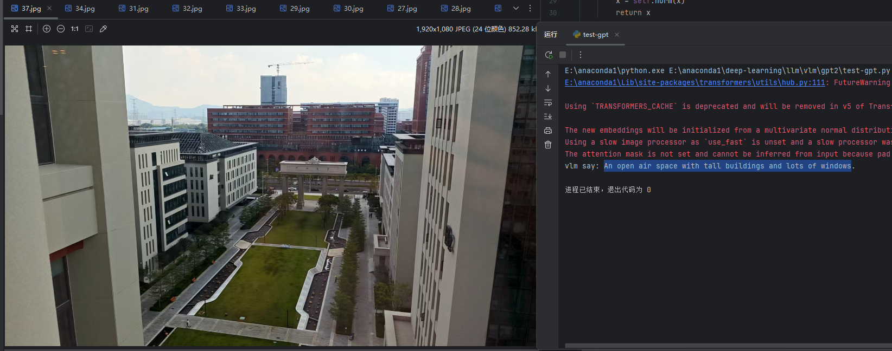
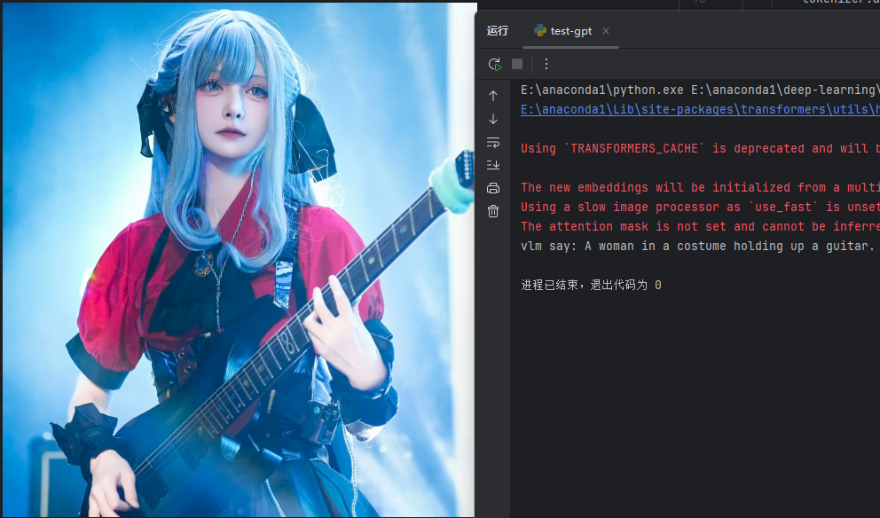

# llm's eye

## 项目简介
`llm's eye` 是一个将 **GPT-2** 改装成 **VLM（Vision-Language Model）** 的简单项目。  
通过直观的方式将 LLM 改造成可处理图像信息的模型，实现图文对齐与描述生成。
并且旨在以最简单的方式处理完成


`下面是一点例子`





> ️ 注意：仅用于 LLM ↔ VLM 的研究学习用途。  
> 即使使用了 COCO 和 Flickr8k 数据集进行较大规模训练，性能不足以作为稳定模型使用。

---

## 模型版本

| Size | LLM 版本       | CLIP 版本                   | 效果说明 |
|------|----------------|-----------------------------|----------|
| mini | distilgpt2     | clip-vit-base-patch16       | 实现简单图文描述，训练快 |
| base | gpt2           | clip-vit-base-patch16       | 基础模型，可以实现比较好的图文描述，训练时长适中 |
| large| gpt2           | clip-vit-large-patch14      | 视觉增强版本，可以更准确地描述图片内容，训练时间长 |

---

## 模型原理

本模型通过 **图像投影 + LLM 序列建模 + 对比学习** 实现图文对齐与生成。

---

### 1. Image Tokens 占位
- 使用 `<images>` token 占位符，将图像信息注入文本 token 序列中。  
- 通过投影层将视觉特征映射到与文本相同的隐空间，  
  从而让原本只能处理文本的 LLM 能够“看到”图片内容。  

---

### 2. 训练输入序列

输入格式：

其中：
- `<image>` embedding 由图像投影层替换。  
- Caption 则由文本 tokenizer 编码。  

---

### 3. 损失函数

#### (1) 语言建模损失 (lm_loss)
- 输入示例：
- GPT 根据 **图像 + caption 上下文** 预测下一个 token。  
- 作用：让 LLM 学会将视觉 embedding 当作上下文，具备图文联合理解与生成能力。  

#### (2) 对比损失 (contrastive_loss, InfoNCE)（负责图像对齐）
- 使用 **文本端的 placeholder embedding**（受图像条件约束）与 **图像平均 embedding** 计算相似度。  
- **正样本**：匹配的图文对。  
- **负样本**：不匹配的图文对。  
- 目标：让正确图文对靠近，错误图文对远离。  
- 机制与 **CLIP** 类似。  

---

### 4. 模型机制
- 输入序列经过 **GPT-2 的 self-attention** 层：  
- 学习图像 tokens 与文本 tokens 的相互依赖。  
- **lm_loss**：保证模型具备文本生成能力。  
- **contrastive_loss**：保证模型具备图文对齐能力。  

---

---

## 训练 Loss说明

### 1. contrastive_loss
- 来源：InfoNCE  
- 作用：让图像 embedding 与对应文本 embedding 互相靠近，同时推远不对应的样本。  
- 直觉理解：
  - 一张图片要和它的 caption 靠得最近。
  - 同时与其他 caption 保持距离。
- 优化目标：提升图文对齐 / 检索能力  
- 指标：Recall@K, CLIPScore, 图→文 / 文→图检索

### 2. lm_loss
- 来源：Cross-Entropy Loss  
- 作用：在图像 embedding 提供上下文的情况下预测 caption 的下一个词。  
- 直觉理解：
  - 给你一张图 + 已有的前几个词，让模型预测下一个词。
  - 强化根据图片生成自然语言描述的能力。
- 优化目标：提升文本生成能力（Captioning, VQA 等）  
- 指标：BLEU, CIDEr, ROUGE

---

## 数据集
- **COCO**
- **Flickr8k_Dataset**
- **Flickr30k_Dataset**
- 推荐先在Flickr8k_Dataset高学习率lr然后依次使用Flickr30k_Dataset，coco2017训练

下载示例（Linux）：
```bash
wget http://images.cocodataset.org/annotations/annotations_trainval2017.zip
wget https://github.com/jbrownlee/Datasets/releases/download/Flickr8k/Flickr8k_Dataset.zip
wget https://github.com/jbrownlee/Datasets/releases/download/Flickr8k/Flickr8k_text.zip
```
数据集预处理
执行下面脚本处理json，统一格式
```bash
python3 data.py
```
训练（可以直接在代码加载部分选择模型型号，通过huggingface加载）
```bash
python3 train.py #初步训练
python3 retrain.py #再次训练
```